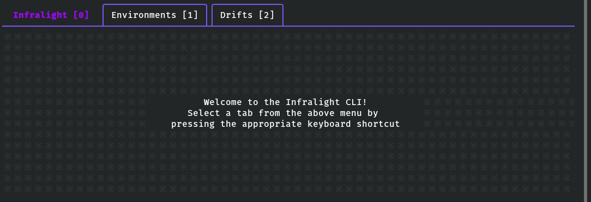

# 

**Firefly Command Line Interface, Terminal User Interface and Client Library**

<!-- vim-markdown-toc GFM -->

- [Overview](#overview)
- [Features](#features)
- [Installation](#installation)
- [Quick Start](#quick-start)
  - [Example 1: Create a Configuration Profile](#example-1-create-a-configuration-profile)
  - [Example 2: Start the TUI](#example-2-start-the-tui)
  - [Example 3: List Available Environments](#example-3-list-available-environments)
- [Development](#development)
  - [Requirements](#requirements)
  - [Available Tasks](#available-tasks)

<!-- vim-markdown-toc -->

## Overview

This repository contains a CLI, TUI and client library for the
[Firefly SaaS](https://infralight.co). Customers can use it to automate Firefly
operations in CI systems; manually execute such operations via the command line;
or integrate the client library into the customer's applications.

The client is written in Go and distributed as a single, statically-linked
executable.



## Features

- Beautiful view-only TUI to fetch information from the Firefly API. Only a
  subset of the features provided by the Firefly Dashboard are also included
  in the TUI.
- Comprehensive suite of CI-friendly commands to access the Firefly API.
- Go client library for integration with customer applications.

## Installation

TODO: once published, modify instructions to download the executable.

```sh
go clone git@github.com:infralight/cli.git
cd cli
./task build
sudo install -Dm755 firefly /usr/local/bin/firefly
```

## Quick Start

```sh
firefly --help
```

The CLI needs an access and secret key-pair to authenticate with the Firefly
API server. A keypair must be created through the Firefly dashboard.

Multiple profiles can be created, each with its own key-pair and a few more
optional settings, such as the ability to override the API URL and name of the
Authorization header (useful when organizational access to Firefly is behind
a reverse proxy). The default profile is called "default". Select a profile by
using the `--profile` or `-p` command line flag.

Alternatively, a key-pair can be provided via the `--access-key` and `--secret-key`
flags. If no profile has been created (or selected), and a key-pair has not
been provided, the user will be prompted to enter the key-pair before the CLI
initializes.

The default API URL and Authorization header can also be modified via the
`--url` and `--auth-header` flags, respectively.

If no command is provided, the program will start the Terminal User Interface.

### Example 1: Create a Configuration Profile

```sh
firefly configure
```

Fill in the required information, including a name for the profile and the
access/secret key-pair. A TOML configuration file will be created in the user's
[$XDG_CONFIG_HOME](https://specifications.freedesktop.org/basedir-spec/basedir-spec-latest.html) directory.

### Example 2: Start the TUI

```sh
firefly
```

### Example 3: List Available Environments

```sh
firefly envs list
```

By default, output is one-lined JSON. To pretty print, add the `--pretty` flag.

## Development

This repository includes a development and CI/CD shell script, [task](task), to
execute common tasks such as compiling the CLI and running tests.

### Requirements

- [Go](https://golang.org/) v1.16+
- [golangci-lint](https://golangci-lint.run/) v1.35+

### Available Tasks

- **build:** compiles a statically-linked executable of the CLI. Will also
  automatically set a version number for the executable from the shorten commit
  hash and the build date.
- **test**: runs unit tests on the entire project.
- **lint:** runs static code analysis and linters on the entire project.
